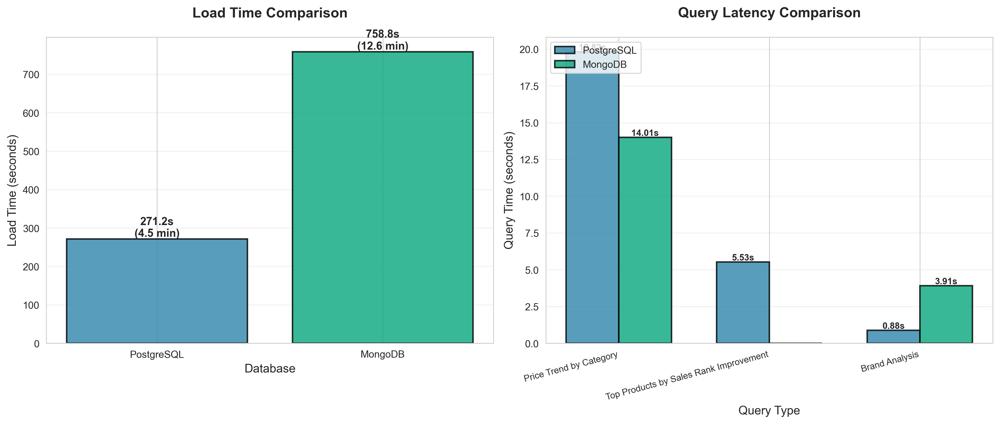

# Comparative Data Warehouse Evaluation: PostgreSQL vs. MongoDB


---

## Executive Summary

This project presents a comprehensive comparative evaluation of **PostgreSQL** (relational) and **MongoDB** (document-oriented) database paradigms for data warehousing applications. We benchmark both systems using **110,000+ Amazon product records** with **20+ million time-series data points**, measuring ingestion performance, analytical query execution, and storage efficiency under identical workloads. Our empirical analysis provides data-driven recommendations for database selection in analytical data warehousing scenarios, revealing significant performance trade-offs between normalized and denormalized schema designs.

---

## Key Results

### Benchmark Visualization



### Performance Summary

| Metric | PostgreSQL | MongoDB | Winner |
| :--- | :--- | :--- | :--- |
| **Bulk Load Time** | ~4.5 mins (271s) | ~12.6 mins (759s) | 🏆 PostgreSQL (2.8x faster) |
| **Simple Read (Price Trends)** | 19.82s | 14.01s | 🏆 MongoDB (1.42x faster) |
| **Complex Analytics (Ranking)** | 5.53s | Failed (Memory Error) | 🏆 PostgreSQL |
| **Brand Analysis (Aggregations)** | 0.88s | 3.91s | 🏆 PostgreSQL (4.45x faster) |
| **Storage Size** | ~3.1 GB | ~2.5 GB | 🏆 MongoDB (19% smaller) |

**Key Finding:** PostgreSQL excels at bulk data ingestion (2.8x faster) and complex analytical queries, while MongoDB shows advantages in simple read operations through data locality. However, MongoDB encounters memory limitations on complex analytical workloads.

---

## 📚 Documentation Index

For detailed technical information, refer to the following comprehensive documents:

### 📖 [Final Technical Report](docs/FINAL_TECHNICAL_REPORT.md)

In-depth analysis covering system architecture, implementation challenges, benchmark methodology, detailed performance results, and evidence-based recommendations for database selection in data warehousing scenarios.

### 🗂 [Data Dictionary](data/DATA_DICTIONARY.md)

Complete dataset schema documentation including field definitions, data types, relationships, foreign key constraints, and data quality specifications. **Note:** Raw CSV data files are git-ignored per Keepa API Terms of Service.

### ✅ [Project Management Log](docs/PROJECT_MANAGEMENT_LOG.md)

Comprehensive record of project execution including team role assignments, task breakdown by phase, individual contributions, timeline, and deliverables. Documents the complete development history from initial setup to final deliverables.

### 📈 [Schema Design](docs/schema_design.md)

Detailed database modeling documentation covering PostgreSQL's normalized star schema design, MongoDB's embedded document strategy, indexing strategies, query patterns, and design rationale for both paradigms.

---

## 🚀 Getting Started

### Prerequisites

- **Docker Desktop** (for containerized databases)
- **Python 3.9+** with pip
- **Git** (for cloning the repository)

### Step 1: Clone & Setup

```bash
# Clone the repository
git clone https://github.com/ichbinlucaskim/SQLWarriors.git
cd SQLWarriors

# Copy environment template (if .env.example exists)
cp .env.example .env

# Create Python virtual environment (recommended)
python -m venv venv
source venv/bin/activate  # On Windows: venv\Scripts\activate

# Install Python dependencies
pip install -r requirements.txt
```

### Step 2: Start Docker Containers

```bash
# Start PostgreSQL and MongoDB containers
docker-compose up -d

# Verify containers are running (should show both as "Up (healthy)")
docker-compose ps
```

**Expected Output:**
```
NAME                   STATUS          PORTS
sqlwarriors_postgres   Up (healthy)    0.0.0.0:5433->5432/tcp
sqlwarriors_mongodb    Up (healthy)    0.0.0.0:27017->27017/tcp
```

**Note:** PostgreSQL is mapped to port **5433** (instead of 5432) to avoid conflicts with local installations. MongoDB uses the standard port 27017.

### Step 3: Verify Database Connections

```bash
# Test database connections
python analysis/test_db_connection.py
```

**Expected Output:**
```
✓ PostgreSQL: CONNECTED
✓ MongoDB: CONNECTED
```

### Step 4: Run Benchmarks

```bash
# Full benchmark (includes data loading - takes ~15-20 minutes)
# This loads 20+ million records into both databases
python analysis/generate_dashboard.py

# Quick benchmark (skips data loading if data already exists)
# Use this for subsequent runs after initial data load
python analysis/generate_dashboard.py --skip-load
```

**Results Location:**
- `benchmark_results.png` - Performance visualization charts
- `benchmark_data.json` - Raw benchmark metrics in JSON format

---

## Docker Container Management

### Common Commands

```bash
# Start containers (background mode)
docker-compose up -d

# Stop containers (data preserved in volumes)
docker-compose stop

# Restart containers
docker-compose restart

# Stop and remove containers (data preserved)
docker-compose down

# Stop and remove containers and volumes (⚠️ deletes all data)
docker-compose down -v

# View logs
docker-compose logs -f              # All logs
docker-compose logs -f postgres     # PostgreSQL only
docker-compose logs -f mongodb      # MongoDB only
```

### Accessing Databases

```bash
# PostgreSQL interactive shell
docker-compose exec postgres psql -U postgres -d amazon_warehouse

# MongoDB interactive shell
docker-compose exec mongodb mongosh
```

### Data Persistence

Database data is stored in local volume mounts:
- **PostgreSQL:** `./docker_data/postgres/`
- **MongoDB:** `./docker_data/mongodb/`

These directories persist data when containers are stopped or removed (unless using `docker-compose down -v`). The `docker_data/` folder is excluded from version control.

---

## Troubleshooting

### Port Conflicts

If ports 5433 or 27017 are already in use:

```bash
# Check what's using the ports
lsof -i :5433
lsof -i :27017

# Stop conflicting services (macOS example)
brew services stop postgresql@17
brew services stop mongodb-community@7.0
```

**Alternative:** Edit `docker-compose.yml` to use different ports, then update `.env` accordingly.

### Container Startup Issues

```bash
# View detailed error logs
docker-compose logs

# Rebuild and restart containers
docker-compose down
docker-compose up -d --build

# Check container health status
docker-compose ps
```

### Connection Errors

```bash
# Verify containers are healthy
docker-compose ps

# Check database logs for errors
docker-compose logs postgres | tail -50
docker-compose logs mongodb | tail -50

# Verify environment variables
cat .env
```

### Memory Issues

- **MongoDB Complex Queries:** May require `allowDiskUse: true` for large aggregation pipelines
- **Python OOM:** Reduce chunk sizes in ETL loaders or increase Docker Desktop memory allocation

---

## Project Structure

```
SQLWarriors/
├── README.md                          # This file (central hub)
├── docker-compose.yml                 # Docker orchestration
├── requirements.txt                   # Python dependencies
├── .env.example                       # Environment variables template
│
├── data/                              # CSV source files (git-ignored)
│   ├── products.csv
│   ├── price_history.csv
│   ├── sales_rank_history.csv
│   ├── product_metrics.csv
│   └── DATA_DICTIONARY.md            # Dataset schema documentation
│
├── etl/                               # ETL Pipeline
│   ├── loader_postgres_csv.py        # PostgreSQL bulk loader
│   └── loader_mongodb_csv.py         # MongoDB document loader
│
├── postgres/                          # PostgreSQL Implementation
│   ├── schema/
│   │   ├── create_tables_csv.sql     # Table definitions
│   │   ├── create_indexes.sql        # Index creation
│   │   └── create_views.sql          # Analytical views
│   ├── queries/
│   │   └── analytical_queries.sql    # Benchmark queries
│   └── config.py                     # Connection configuration
│
├── mongodb/                           # MongoDB Implementation
│   ├── schema/
│   │   ├── collections.py            # Collection definitions
│   │   └── indexes.py                # Index creation
│   ├── queries/
│   │   └── aggregation_pipelines.py  # Benchmark queries
│   └── config.py                     # Connection configuration
│
├── benchmarks/                        # Benchmarking Scripts
│   ├── load_performance.py           # Ingestion benchmarks
│   └── query_performance.py          # Query latency benchmarks
│
├── analysis/                          # Analysis & Visualization
│   ├── generate_dashboard.py         # Automated benchmark suite
│   └── test_db_connection.py         # Connection diagnostics
│
└── docs/                              # Documentation
    ├── FINAL_TECHNICAL_REPORT.md     # Comprehensive technical report
    ├── PROJECT_MANAGEMENT_LOG.md     # Project execution log
    ├── schema_design.md              # Database modeling details
    └── results/
        └── benchmark_results.png     # Benchmark visualization
```

---

## Dataset Overview

- **Products:** 109,992 unique product records
- **Price History:** 9,899,280 time-series records (~90 per product)
- **Sales Rank History:** 9,899,280 time-series records (~90 per product)
- **Total Records:** 20,018,544 rows across all tables
- **Data Format:** CSV files with standardized schema

**Note:** Raw CSV data files are not included in this repository due to Keepa API Terms of Service. Users must place the CSV files in the `data/` directory manually to run the ETL pipeline. See [Data Dictionary](data/DATA_DICTIONARY.md) for detailed schema specifications.

---

## Technologies

- **Python 3.9+** - ETL pipeline and benchmarking
- **PostgreSQL 13** - Relational database with optimized query engine
- **MongoDB 5.0** - Document database with embedded document model
- **Docker Compose** - Container orchestration for reproducible environments
- **Pandas** - Data processing and transformation
- **Matplotlib/Seaborn** - Visualization and reporting
- **Psycopg2** - PostgreSQL Python driver
- **PyMongo** - MongoDB Python driver

---

## Authors

- **Philip Anand** - Data Mining Lead
- **Kevin Perez** - SQL Warehouse Architect
- **Lucas Kim** - Lead Data Engineer & System Architect

**Course:** CMSI-620 Database Systems  
**Institution:** Loyola Marymount University  
**Project Duration:** November 25, 2025 - December 9, 2025

---

## License

This project is licensed under the MIT License. See the LICENSE file for details.

**Academic Context:** This project was developed as part of CMSI-620 (Database Systems) coursework at Loyola Marymount University, focusing on practical evaluation of database paradigms in real-world data warehousing scenarios.

---

## Acknowledgments

- **Database Communities:** PostgreSQL and MongoDB open-source communities for excellent documentation and tools
- **Instructors:** CMSI-620 faculty for project guidance and feedback
- **Dataset Source:** CSV-based Amazon product data for e-commerce analytics benchmarking

---

## Contributing

This is an academic research project. For questions or collaboration inquiries, please open an issue or contact the project maintainers.
