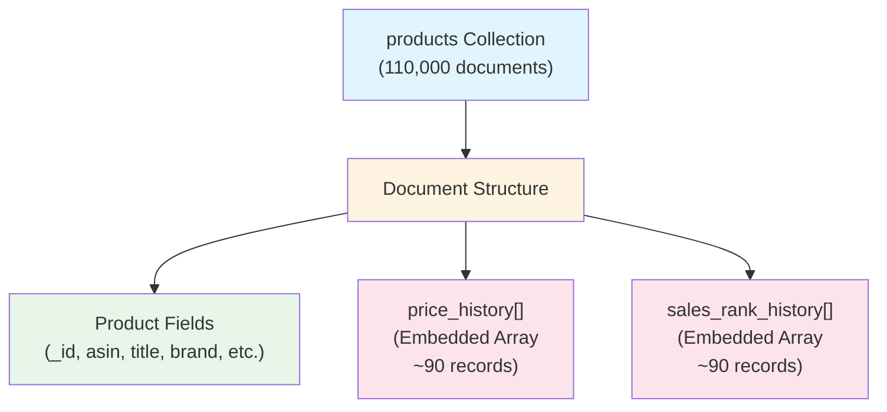

# MongoDB Schema (Document Structure)

## Collection: products (Denormalized Document Model)

> **Note:** Unlike relational databases, MongoDB stores data as JSON-like documents. This schema visualization shows the actual document structure rather than table relationships. Compare with [PostgreSQL ERD](./PostgreSQL_ERD.md) to see the difference between document and relational models.


### Document Structure Visualization



### Actual JSON Document Example

```json
{
  "_id": ObjectId("507f1f77bcf86cd799439011"),
  "asin": "B0DGHMNQ5Z",
  "title": "Product Title",
  "brand": "Brand Name",
  "source_category": "Electronics",
  "category": "Electronics",
  "current_price": 19.9,
  "current_sales_rank": 1.0,
  "rating": 4.5,
  "review_count": 18819,
  "description": "Product description text",
  "features": ["Feature 1", "Feature 2"],
  "created_at": ISODate("2025-01-01T00:00:00Z"),
  "updated_at": ISODate("2025-01-01T00:00:00Z"),
  
  "price_history": [
    {
      "date": ISODate("2025-01-01"),
      "price_usd": 19.9,
      "source_category": "Electronics",
      "brand": "Brand Name",
      "price_bucket": "$10-$20",
      "offer_count": 5
    },
    {
      "date": ISODate("2025-01-02"),
      "price_usd": 18.9,
      "source_category": "Electronics",
      "brand": "Brand Name",
      "price_bucket": "$10-$20",
      "offer_count": 6
    }
    // ... ~88 more records
  ],
  
  "sales_rank_history": [
    {
      "date": ISODate("2025-01-01"),
      "sales_rank": 1.0,
      "source_category": "Electronics",
      "brand": "Brand Name",
      "rank_bucket": "Top 100",
      "review_count": 18819,
      "average_rating": 4.5
    },
    {
      "date": ISODate("2025-01-02"),
      "sales_rank": 2.0,
      "source_category": "Electronics",
      "brand": "Brand Name",
      "rank_bucket": "Top 100",
      "review_count": 18850,
      "average_rating": 4.5
    }
    // ... ~88 more records
  ]
}
```

### Document Structure Breakdown

```
products Collection
└── Document (1 per product, 110K total)
    ├── Product Metadata (Scalar Fields)
    │   ├── _id: ObjectId (Primary Key)
    │   ├── asin: String (Unique Identifier)
    │   ├── title: String
    │   ├── brand: String
    │   ├── source_category: String
    │   ├── current_price: Number
    │   ├── current_sales_rank: Number
    │   ├── rating: Number
    │   ├── review_count: Integer
    │   └── created_at, updated_at: Date
    │
    ├── price_history: Array[Object] ⬅️ EMBEDDED
    │   └── Array Items (~90 per product)
    │       ├── date: Date
    │       ├── price_usd: Number
    │       ├── source_category: String (denormalized)
    │       ├── brand: String (denormalized)
    │       ├── price_bucket: String
    │       └── offer_count: Integer
    │
    └── sales_rank_history: Array[Object] ⬅️ EMBEDDED
        └── Array Items (~90 per product)
            ├── date: Date
            ├── sales_rank: Number
            ├── source_category: String (denormalized)
            ├── brand: String (denormalized)
            ├── rank_bucket: String
            ├── review_count: Integer
            └── average_rating: Number
```

## Key Differences from Relational Databases

### Document Model vs Table Model

| Aspect | MongoDB (Document) | PostgreSQL (Relational) |
|--------|-------------------|------------------------|
| **Storage Unit** | Document (JSON-like) | Row in Table |
| **Relationships** | Embedded Arrays | Foreign Keys + JOINs |
| **Data Access** | Single document read | Multiple table JOINs |
| **Structure** | Hierarchical JSON | Flat normalized tables |
| **Flexibility** | Dynamic schema | Fixed schema |

### Design Pattern: Embedded Document Model

- **Single Collection**: All data stored in `products` collection (110,000 documents)
- **Embedded Arrays**: Time-series data stored as arrays within each document
- **No JOINs**: Related data accessed directly from single document
- **Data Locality**: All related data co-located in one document
- **Denormalization**: Category and brand duplicated in embedded arrays for query optimization

### Embedded Relationships

- **Document → price_history[]**: Embedded Array
  - Each product document contains `price_history` array field
  - Average ~90 price records per product
  - Stored directly in the document (no separate collection)

- **Document → sales_rank_history[]**: Embedded Array
  - Each product document contains `sales_rank_history` array field
  - Average ~90 rank records per product
  - Stored directly in the document (no separate collection)

### Indexes

**Single Field Indexes:**
- `asin` (unique)
- `brand`
- `category` / `source_category`
- `updated_at`

**Compound Indexes:**
- `(category, brand)`
- `(category, updated_at)`

**Embedded Array Indexes:**
- `price_history.date`
- `price_history.price`
- `sales_rank_history.date`
- `sales_rank_history.sales_rank`

**Text Indexes:**
- `(title, description)` - Full-text search

### Key Characteristics

1. **Denormalization**: Category and brand duplicated in embedded arrays for query optimization
2. **Document Size**: Average document size manageable (< 16MB MongoDB limit)
3. **Query Optimization**: Indexes on embedded array fields enable efficient filtering
4. **Read Performance**: Single document read eliminates JOIN operations

