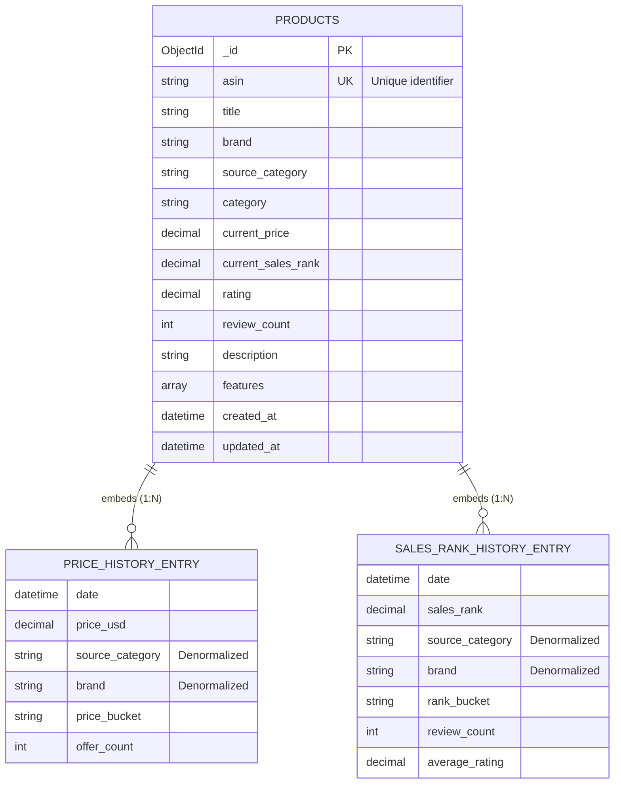

# MongoDB Schema ERD

## Collection: products (Denormalized Document Model)

## Schema Notes

### Design Pattern: Embedded Document Model

- **Single Collection**: All data stored in `products` collection
- **Embedded Arrays**: Time-series data embedded as arrays within product documents
- **No Joins**: Related data accessed directly within single document read
- **Data Locality**: Price and sales rank history co-located with product data

### Relationship Types

- **PRODUCTS → PRICE_HISTORY_ENTRY**: 1:N (Embedded Array)
  - One product document contains multiple price history entries
  - Stored as `price_history[]` array field
  - Average ~90 records per product

- **PRODUCTS → SALES_RANK_HISTORY_ENTRY**: 1:N (Embedded Array)
  - One product document contains multiple sales rank history entries
  - Stored as `sales_rank_history[]` array field
  - Average ~90 records per product

### Indexes

**Single Field Indexes:**
- `asin` (unique)
- `brand`
- `category` / `source_category`
- `updated_at`

**Compound Indexes:**
- `(category, brand)`
- `(category, updated_at)`

**Embedded Array Indexes:**
- `price_history.date`
- `price_history.price`
- `sales_rank_history.date`
- `sales_rank_history.sales_rank`

**Text Indexes:**
- `(title, description)` - Full-text search

### Key Characteristics

1. **Denormalization**: Category and brand duplicated in embedded arrays for query optimization
2. **Document Size**: Average document size manageable (< 16MB MongoDB limit)
3. **Query Optimization**: Indexes on embedded array fields enable efficient filtering
4. **Read Performance**: Single document read eliminates JOIN operations

