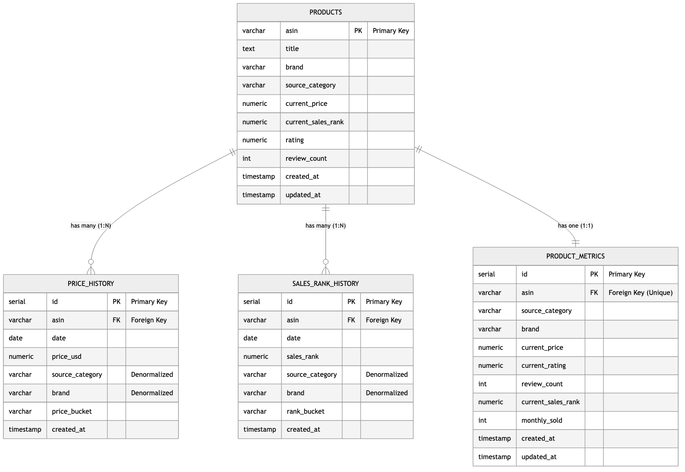
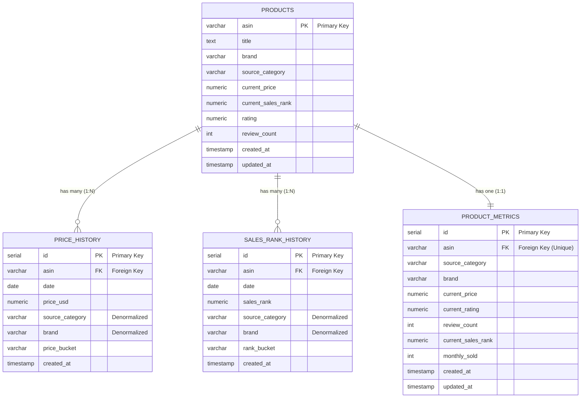

# PostgreSQL Schema ERD

## Star Schema Design (Normalized Relational Model)

> **Note:** GitHub automatically renders the Mermaid diagram below. Image versions (PNG/SVG) are also available in `docs/images/` directory.

<!--  -->

### Interactive Diagram (GitHub Renders Automatically)

## Schema Notes

### Design Pattern: Normalized Star Schema

- **Dimension Table**: `products` - Master product data
- **Fact Tables**: `price_history`, `sales_rank_history` - Time-series transactional data
- **Aggregation Table**: `product_metrics` - Pre-computed metrics for query optimization
- **Referential Integrity**: All foreign keys enforce `ON DELETE CASCADE`

### Relationship Types

- **PRODUCTS → PRICE_HISTORY**: 1:N (One-to-Many)
  - One product can have multiple price history records
  - Foreign Key: `price_history.asin` → `products.asin`
  - Unique constraint: `(asin, date)` prevents duplicate entries
  - Average ~90 records per product

- **PRODUCTS → SALES_RANK_HISTORY**: 1:N (One-to-Many)
  - One product can have multiple sales rank history records
  - Foreign Key: `sales_rank_history.asin` → `products.asin`
  - Unique constraint: `(asin, date)` prevents duplicate entries
  - Average ~90 records per product

- **PRODUCTS → PRODUCT_METRICS**: 1:1 (One-to-One)
  - One product has exactly one metrics snapshot
  - Foreign Key: `product_metrics.asin` → `products.asin`
  - Unique constraint on `asin` ensures one-to-one relationship
  - Pre-aggregated for fast analytical queries

### Indexes

**Products Table:**
- Primary Key: `asin`
- Index on `brand`
- Index on `source_category`
- Index on `updated_at`

**Price History Table:**
- Primary Key: `id`
- Foreign Key Index: `asin`
- Index on `date`
- Composite Index: `(asin, date)`
- Index on `price_usd`

**Sales Rank History Table:**
- Primary Key: `id`
- Foreign Key Index: `asin`
- Index on `date`
- Composite Index: `(asin, date)`
- Index on `sales_rank`

**Product Metrics Table:**
- Primary Key: `id`
- Foreign Key Index: `asin` (unique)

### Key Characteristics

1. **Normalization**: Separate tables eliminate data redundancy
2. **Referential Integrity**: Foreign key constraints ensure data consistency
3. **Denormalization**: Category and brand duplicated in fact tables for query optimization
4. **Time-Series Optimization**: Composite indexes on `(asin, date)` optimize time-series queries
5. **Query Performance**: Aggregation table eliminates expensive JOINs for common metrics

